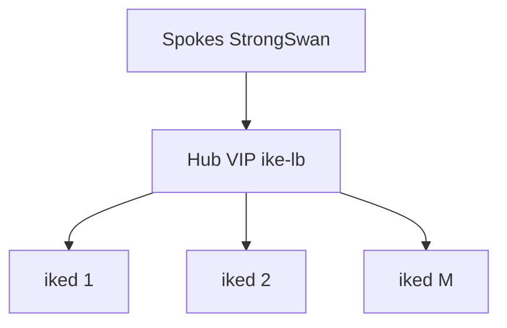
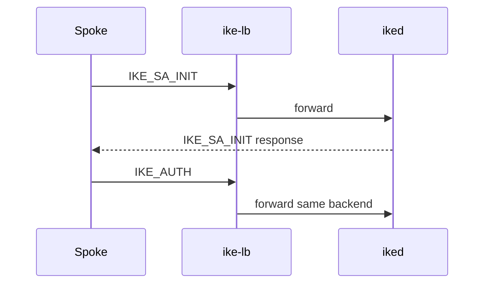

# IKEv2 Load Balancer for Hub–Spoke (OpenIKED + StrongSwan)

## 1. Problem statement

| Requirement | Detail |
|-------------|--------|
| IKE stack | [openiked-portable](https://github.com/openiked/openiked-portable) (`iked`) on hub routers |
| Topology | Large **hub–spoke** network (spokes initiate to hub) |
| Interop | **StrongSwan** peers in **client or server** role |
| Goal | **IKEv2 load balancer** so many spokes can use one hub VIP and sessions spread across multiple `iked` instances |

The earlier educational `ikev2-server` in this repo is **not** a replacement for OpenIKED. It only parses IKE headers for testing. Production hubs run **openiked** behind **`ike-lb`**.

**Interop scope (required vs optional):** [INTEROP.md — Required vs optional scenarios](INTEROP.md#required-vs-optional-scenarios). IKE structure and algorithms are **required**; ESP/routing/MOBIKE/HA are documented separately.

---

## 2. Flow diagrams and explanations

> **Full diagrams (Mermaid + steps):** [FLOWS.md](FLOWS.md) — use for Webex / submission walkthrough.

### 2.1 Hub–spoke in one view



1. Every spoke sends IKE only to the **hub VIP**.  
2. `ike-lb` assigns each new tunnel to one **iked** backend.  
3. The **same backend** handles the full IKE session (SA_INIT → AUTH → CHILD_SA).  
4. **ESP/user traffic** uses IPsec in the kernel — not through the LB.

### 2.2 IKE_SA_INIT message flow (simplified)

| Step | Direction | Action |
|------|-----------|--------|
| 1 | Spoke → VIP | IKE_SA_INIT (Initiator SPI set, Responder SPI = 0) |
| 2 | `ike-lb` | Parse header → `backend = hash(init_spi) % N` → save session |
| 3 | `ike-lb` → Backend | Forward UDP payload unchanged |
| 4 | Backend → Spoke | IKE_SA_INIT response (Responder SPI assigned) |
| 5 | Spoke → VIP | All further IKE uses **both SPIs** → lookup → **same backend** |



### 2.3 Load balancer decision (per packet)

```
Packet on VIP
    → read Initiator SPI + Responder SPI
    → if new SA: pick backend, insert table
    → else: lookup table
    → forward UDP to backend socket
```

---

## 3. High-level design (HLD)

### 3.1 Placement

```
  [Spoke A]  StrongSwan          [Spoke B]  StrongSwan
       \                              /
        \   IKE UDP 500 / 4500 (NAT-T) /
         v                            v
              Hub VIP (ike-lb)
                       |
       +---------------+---------------+
       |               |               |
   iked@hub1       iked@hub2       iked@hub3   (openiked-portable)
       |               |               |
       +------- IPsec SAs / routing -----+
                    (hub data plane)
```

- Spokes always use the **hub VIP** as IKE peer address (`remote` in StrongSwan / `peer` in `iked.conf`).
- **`ike-lb`** listens on the VIP (UDP 500 and optionally 4500).
- Each new IKE SA is assigned to one backend `iked` using **sticky mapping on IKE SPIs**.
- Backends reply **directly to the spoke** (asymmetric path). All **initiator** IKE packets must still hit the VIP so stickiness holds.

### 3.2 Why IKE cannot use plain round-robin

IKEv2 state is per daemon process:

1. **IKE_SA_INIT** — only Initiator SPI is meaningful; Responder SPI is zero in the request.
2. Later exchanges carry **both SPIs**; the same `iked` that created the responder SPI must handle the SA.
3. Child SA creation (**IKE_AUTH**, **CREATE_CHILD_SA**) must land on the same backend.

So the LB must be **IKE-aware** (parse 28-byte IKE header) or use an equivalent SPI hash with a shared session table.

### 3.3 Load-balancing algorithm

| Phase | Selection rule |
|-------|----------------|
| New SA (Responder SPI = 0) | `backend = backends[hash(initiator_spi) % N]` |
| Existing SA | Lookup `(initiator_spi, responder_spi)` → backend |
| NAT-T | Same logic on UDP 4500; session key includes `(spoke_ip, spoke_port, spi_pair)` |

### 3.4 StrongSwan interoperability

| Topic | Action |
|-------|--------|
| Protocol | RFC 7296 — both stacks; no proprietary payloads required |
| Proposals | **Identical** `ikesa` algorithms on every hub `iked` (e.g. AES-GCM, PRF-SHA256, DH14/19) |
| Auth | Same PSK or same hub certificate + CA on all backends |
| IDs | Consistent `ikeid` / `leftid` / `rightid` so any backend accepts the spoke |
| NAT-T | Enable on hub and spoke (`forceencaps`, `iked` `udpencap`) |
| Roles | Spoke=StrongSwan client / Hub=server is the common hub–spoke case; LB VIP is hub `remote` |
| StrongSwan as server | Spoke runs `iked` initiating to StrongSwan VIP — LB in front of StrongSwan is a **separate** design (not hub openiked); same SPI stickiness applies |

Config snippets: see [INTEROP.md](INTEROP.md).

### 3.5 Scalability (summary)

The design **scales horizontally** by adding `iked` backends behind one hub VIP; the prototype `ike-lb` supports up to **65,536** concurrent IKE sessions and **32** backends (build-time limits). See **[§5 Scalability](#5-scalability)** for capacity model, limits, and production upgrades.

### 3.6 Alternatives considered

| Approach | Pros | Cons |
|----------|------|------|
| **IKE-aware UDP proxy (`ike-lb`)** | Full control, works with openiked | Custom component to operate |
| **nftables/iptables L4 + SPI hash** | Kernel performance | Harder NAT-T, limited stickiness |
| **IKE Redirect (NOTIFY)** | Standards-based | Must verify openiked/StrongSwan redirect support |
| **Single iked + VRRP** | Simple | Active/standby, not load share |

---

## 4. Low-level design (LLD)

### 4.1 Components

```
ike-lb (this repo)
├── ike_lb_main.c      UDP listeners 500/4500
├── ike_lb_session.c   SPI → backend table (hash)
├── ike_lb_pcap.c      optional PCAP (--pcap)
└── reuses ike_msg.c   IKE header decode (RFC 7296 §3.1)
```

### 4.2 Session table entry

```c
struct ike_lb_session {
    struct sockaddr_storage client_addr;
    socklen_t client_len;
    uint8_t initiator_spi[8];
    uint8_t responder_spi[8];
    int backend_index;
    time_t last_seen;
};
```

- **Insert** on first IKE_SA_INIT (responder_spi all zero) after choosing backend.
- **Update** responder_spi when seeing response (optional optimization).
- **Lookup** on every packet: match SPIs + client tuple (NAT may change port only on spoke side — key includes IP and port).

### 4.3 Packet flow (asymmetric return)

```
Spoke --(1) IKE req--> VIP:ike-lb --(2) forward--> iked@hub2
Spoke <--(4) IKE resp-- iked@hub2 <--(3) direct reply (source = hub2)
Spoke --(5) IKE_AUTH--> VIP:ike-lb --(6) lookup SPI--> hub2
```

Requirements:

- Spoke **always** targets VIP for outbound IKE.
- Hub routing: each `iked` host can reach spoke subnets (hub–spoke routes).
- Firewall: allow hub2 → spoke UDP 500/4500.

### 4.4 openiked backend

- Build/install [openiked-portable](https://github.com/openiked/openiked-portable).
- `iked` listens on **backend real IP**, not VIP (or loopback if co-located with `ike-lb`).
- `ike-lb.conf` lists `backend 10.0.0.11 500`, `backend 10.0.0.12 500`, etc.

### 4.5 Failure modes

| Failure | Mitigation |
|---------|------------|
| Backend dies mid-IKE | Spoke re-initiates; new SPI → new backend (brief outage) |
| LB restart | Session table lost; spokes retry IKE_SA_INIT |
| Mismatched crypto between backends | IKE_AUTH fails; enforce config management |
| StrongSwan MOBIKE | May change address; extend session key if MOBIKE required |

---

## 5. Scalability

See [FLOWS.md](FLOWS.md) for traffic path vs control-plane path.

### 5.1 Design goals

| Goal | Approach |
|------|----------|
| Many spokes → one hub | Single IKE VIP; SPI-based stickiness |
| Grow hub IKE capacity | Add `iked` backends; hash new sessions by Initiator SPI |
| Avoid backend state split | Same SPI pair always reaches the same `iked` |
| Operate at hub–spoke scale | Config parity + routing + documented limits below |

The architecture is **scalable in principle** (standard IKEv2 LB pattern). The **current C implementation** is a single-process prototype suitable for lab and **moderate** hub load.

### 5.2 What scales well

```
                    +------------------+
   Spoke 1..N ----> |  Hub VIP (ike-lb) |
                    +--------+---------+
                             |
              +--------------+--------------+
              |              |              |
         iked hub1      iked hub2      iked hubM
         (openiked)     (openiked)     (openiked)
```

| Dimension | Mechanism | Current limit (build-time) |
|-----------|-----------|----------------------------|
| Concurrent IKE sessions | Session table keyed by SPI + client | `IKE_LB_MAX_SESSIONS` = **65536** (default) |
| Hub IKE responders | Backend pool + consistent hash on Initiator SPI | `IKE_LB_MAX_BACKENDS` = **32** (default) |
| New session rate | O(1) backend pick via SPI hash | Single-threaded UDP loop (see below) |
| Spoke count | Stateless toward spokes; each spoke = 1+ IKE SAs | Limited by hub PPS and `iked` CPU |
| Geographic / logical hubs | Multiple hub sites each with own VIP + LB + backends | Deploy per site (not federated in prototype) |

**Horizontal scaling:** add backends in `ike-lb.conf` with **identical** `iked.conf` on every node. No spoke reconfiguration when expanding the pool (VIP unchanged).

**Vertical scaling (per backend):** faster CPU, kernel IPsec offload, tuning `iked` — outside `ike-lb` but required for total hub throughput.

### 5.3 Bottlenecks in the prototype (`ike-lb`)

| Bottleneck | Effect | Severity |
|------------|--------|----------|
| **Single-threaded `poll()` loop** | One core processes all UDP receive/forward | High at very high PPS |
| **Linear session lookup** | Scan session table (up to 65k entries) per packet | Medium at thousands of active SAs |
| **Userspace UDP proxy** | More CPU per packet than kernel LB (nftables/IPVS/DPDK) | Medium under heavy IKE rekey storms |
| **No `ike-lb` HA** | One LB process; VIP failover needs VRRP/keepalived or redundant design | Ops / availability, not throughput |
| **No dynamic health checks** | Dead backend breaks in-flight SAs until spoke re-initiates | Availability |
| **In-memory session table** | Lost on `ike-lb` restart; spokes retry IKE_SA_INIT | Brief disruption at restart |
| **Lab demo stack** | `ikev2-server` / stub crypto — not measured with real openiked load | Testing gap |

### 5.4 Capacity planning (rules of thumb)

| Metric | Planning note |
|--------|----------------|
| Active IKE sessions | ≤ `IKE_LB_MAX_SESSIONS`; idle timeout `IKE_LB_SESSION_TIMEOUT` (default 3600 s) |
| Backends | `N` backends; new sessions ≈ `hash(init_spi) % N` (even spread over many spokes) |
| Packets per second | Driven by IKE rekeys, DPD, NAT-T keepalives — budget **per backend**, not only LB |
| Memory | ~session table entry per active SA (client addr + SPIs + metadata) |
| Firewall / routing | Hub must reach all spoke subnets; allow UDP 500/4500 and ESP |

For **very large** spoke counts (e.g. 10k+ routers), validate with:

- Parallel initiators in lab (`scripts/run_multi_session_e2e.sh` — small sample)
- Production-style load on real `iked` + StrongSwan
- Monitoring: sessions per backend, UDP errors, IKE failure rate

### 5.5 Production scaling path

| Stage | Enhancement |
|-------|-------------|
| **Near term** | Hash table for SPI → backend (O(1) lookup); backend health probe + drain |
| **Multi-core** | Multiple `ike-lb` workers with SO_REUSEPORT or fixed shard per CPU |
| **High PPS** | Kernel UDP LB (nftables/IPVS) with SPI-aware stickiness; or DPDK |
| **HA** | Active/standby or active/active VIP (keepalived) for `ike-lb`; session sync optional |
| **Operations** | Git/Ansible for `iked.conf`; metrics (Prometheus), centralized logging |
| **Data plane** | ESP handled by kernel + `iked`/StrongSwan — scale IPsec separately from IKE LB |

### 5.6 Scalability vs alternatives (from §3.6)

| Approach | Scale-out IKE | Notes |
|----------|---------------|--------|
| **ike-lb (this project)** | Add `iked` backends | IKE-aware; custom ops |
| **Kernel L4 + SPI hash** | Add backends | Higher PPS; harder NAT-T / stickiness |
| **IKE Redirect** | Add backends | Depends on peer redirect support |
| **Single iked + VRRP** | No IKE scale-out | HA only, not load share |

### 5.7 Assignment / submission statement

> The solution scales horizontally by placing an IKE-aware load balancer in front of a pool of openiked backends. Spokes use a single hub VIP; session stickiness on IKE SPIs allows any backend to serve new tunnels while preserving per-SA state. The prototype enforces configurable upper bounds (65,536 sessions, 32 backends) and documents single-process and lookup optimizations as the path to carrier-scale hubs.

---

## 6. Testing / validation

**Real-world practicality** (lab vs production, gaps, ops): [PRACTICALITY.md](PRACTICALITY.md). Test IDs: [TEST_PLAN.md](TEST_PLAN.md).

1. **Unit**: IKE header parse, SPI hash, session insert/lookup (`test_ike_msg`, `test_ike_lb`).
2. **Lab**: `ike-lb` + demo servers or 2× `iked`; automated E2E + PCAP (`make test-all`).
3. **Interop (manual)**: StrongSwan → VIP; `ikectl sa` on expected backend (S-01–S-04).
4. **Scale**: multi-session spread (`make test-e2e-multi`); production = more spokes + identical `iked.conf`.
5. **Production-only**: NAT-T, IKE_AUTH/certs, ESP/ping, backend drain, asymmetric IKE return — see PRACTICALITY §6.

---

## 7. Implementation status in this repo

| Component | Status |
|-----------|--------|
| IKE header / payload parse | Done (`ike_msg.c`) |
| `ike-lb` UDP proxy + SPI table | See `src/ike_lb_*.c`, `bin/ike-lb` |
| openiked integration | Documented; deploy `iked` separately |
| StrongSwan templates | [INTEROP.md](INTEROP.md) |
