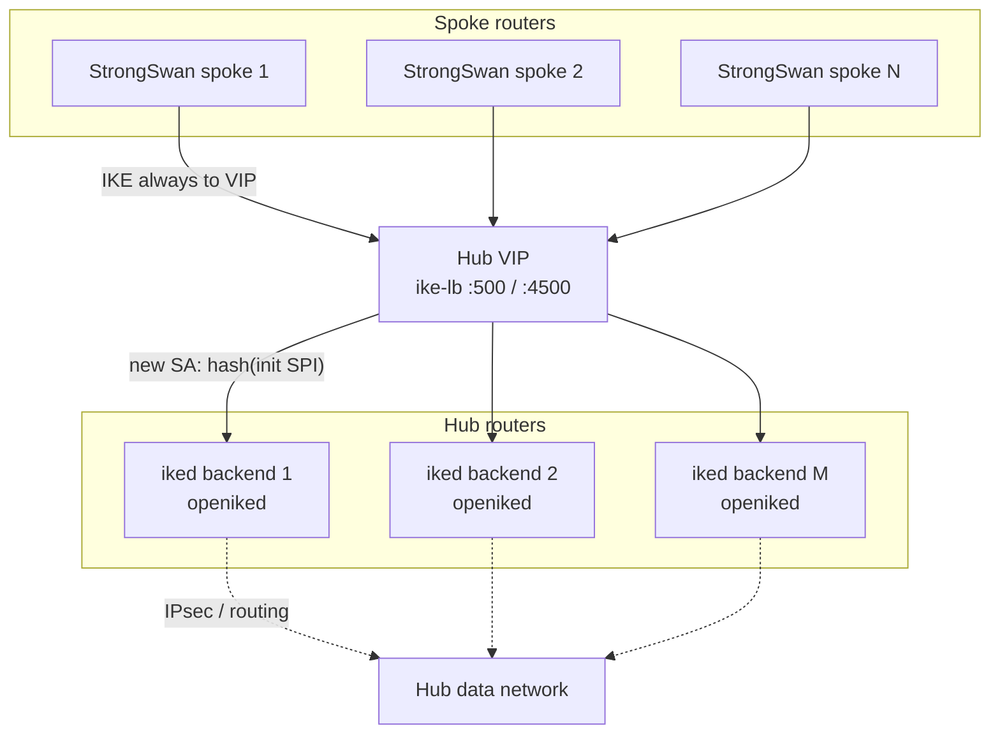
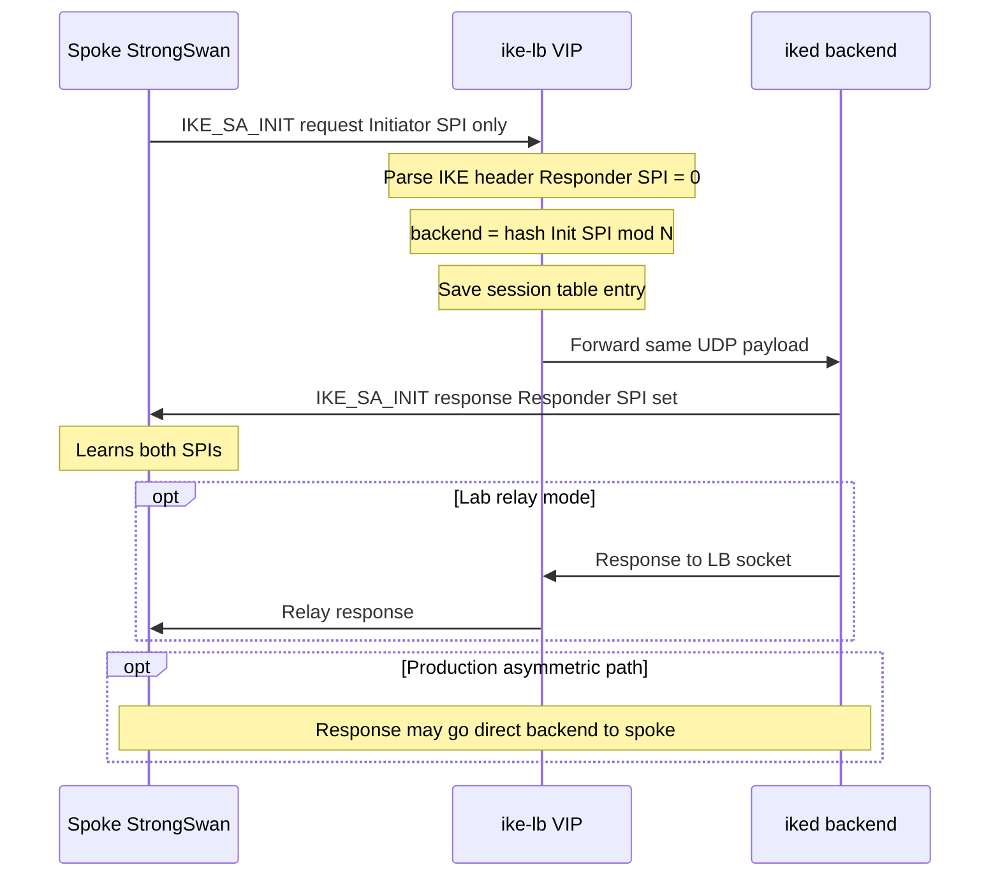
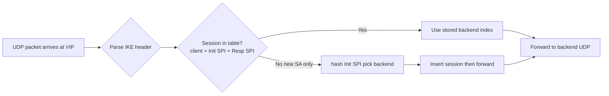
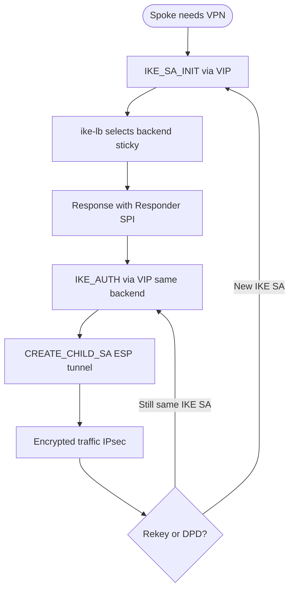
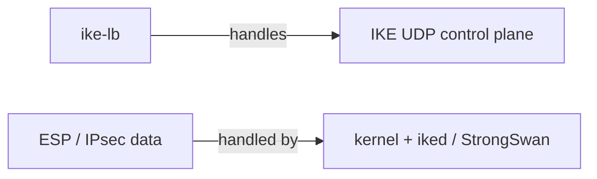

# IKEv2 Load Balancer — Flows & Diagrams

Simple views for architecture review, Webex recording, and submission.

---

## 1. Hub–spoke topology (one picture)



**In one sentence:** Spokes talk only to the **VIP**; `ike-lb` picks a backend and **sticks** to it for that IKE session.

---

## 2. IKE_SA_INIT flow (first contact)

### Sequence (lab / production initiator path)



### Steps (numbered)

| Step | Who | What happens |
|------|-----|----------------|
| 1 | Spoke | Sends **IKE_SA_INIT** to **hub VIP** (not backend IP). |
| 2 | `ike-lb` | Reads **Initiator SPI** (first 8 bytes). Responder SPI is zero. |
| 3 | `ike-lb` | Chooses backend: `hash(init_spi) % number_of_backends`. |
| 4 | `ike-lb` | Stores mapping: client address + SPIs → backend index. |
| 5 | `ike-lb` | Forwards UDP datagram to that **iked** (unchanged payload). |
| 6 | `iked` | Builds IKE response (SA, KE, Nonce); sends to spoke. |
| 7 | Spoke | Continues IKE to **VIP** for all later messages (IKE_AUTH, …). |

---

## 3. Existing session (sticky path)



| Step | What happens |
|------|----------------|
| 1 | Every IKE packet to VIP includes **both SPIs** (after SA_INIT). |
| 2 | `ike-lb` **looks up** session table → same backend as before. |
| 3 | Packet is **forwarded** to that `iked` only. |
| 4 | **Wrong backend** would break IKE_AUTH / CHILD_SA → stickiness is mandatory. |

---

## 4. Full IKE lifecycle (hub–spoke)



| Phase | Via VIP? | Same backend? |
|-------|----------|---------------|
| IKE_SA_INIT | Yes | Selected here |
| IKE_AUTH | Yes | Must match |
| CREATE_CHILD_SA | Yes | Must match |
| ESP data | No (kernel) | N/A |
| Rekey on same IKE SA | Yes | Must match |

---

## 5. What `ike-lb` does *not* handle



- **Does:** UDP 500/4500, SPI stickiness, forward to backends.  
- **Does not:** Terminate IPsec, route spoke LANs, or negotiate certificates (that is **iked** / StrongSwan).

---

## 6. ASCII summary (copy-friendly)

```
  SPOKE                          HUB
  -----                          ---

  [StrongSwan] ----IKE_SA_INIT----> [ VIP : ike-lb ]
                                         |
                                    pick backend
                                         |
                                         v
                                   [ iked hub2 ]
                                         |
  [StrongSwan] <---IKE_SA_INIT resp-----+  (direct or via LB relay)

  [StrongSwan] ----IKE_AUTH--------> [ VIP : ike-lb ] ---> [ iked hub2 ]  (same!)
  [StrongSwan] <=== ESP traffic ===>  hub routing / kernel   (not through LB)
```

---

---

## 7. Lab vs production (practicality)

| Aspect | Lab (`make test`) | Production |
|--------|-------------------|------------|
| Client | `ikev2-client` | StrongSwan spoke |
| Responder | `ikev2-server` × N | openiked × N |
| IKE reply path | **Through LB** (relay) | Often **direct** backend → spoke |
| Initiator IKE | Always to VIP | Always to VIP (required) |
| ESP / routing | Not tested | Kernel + hub routes |

**Test mapping:** [PRACTICALITY.md](PRACTICALITY.md) links each test ID (U/I/P/S) to these flows.

See also: [DESIGN.md](DESIGN.md) (HLD/LLD), [INTEROP.md](INTEROP.md) (StrongSwan / openiked config), [TEST_PLAN.md](TEST_PLAN.md) §2.
