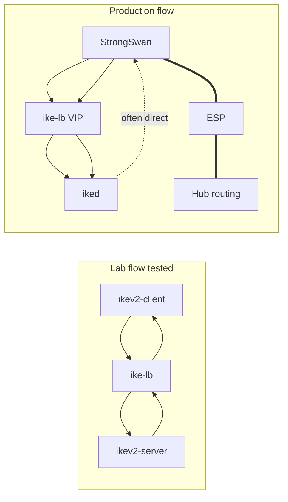

# Real-world practicality — tests, flows, and operations

How lab work maps to a **production hub–spoke** deployment (StrongSwan spokes → hub VIP → openiked pool).

Related: [FLOWS.md](FLOWS.md) (diagrams), [TEST_PLAN.md](TEST_PLAN.md) (test IDs), [INTEROP.md](INTEROP.md) (configs).

---

## 1. Real-world deployment model

| Layer | Production component | Lab stand-in |
|-------|---------------------|--------------|
| Spoke | Router with **StrongSwan** (`swanctl`) | `bin/ikev2-client` |
| Hub front door | **VIP** on hub router (Anycast or VRRP) | `127.0.0.1:5000` |
| IKE LB | **`ike-lb`** on VIP | Same binary |
| IKE responder pool | **openiked** × M on backend IPs | `bin/ikev2-server` × 2 |
| Data plane | Kernel **ESP**, routing, firewall | Not exercised in CI |
| Config | Identical `iked.conf` + Git/Ansible | `config/ike-lb.conf` only |

---

## 2. Real-world considerations (checklist)

### 2.1 Network & topology

| Consideration | Why it matters | Covered by |
|---------------|----------------|------------|
| Spokes use **VIP only** | Avoid bypassing stickiness | I-02, I-04, S-01, [FLOWS §2](FLOWS.md) |
| Hub routes to **all spoke LANs** | IKE/ESP return path | Manual ops; [INTEROP checklist](INTEROP.md) |
| **Asymmetric IKE** (reply direct backend→spoke) | Common on routers; LB sees all **initiator** IKE | DESIGN §4.3, I-03 relay mode in lab |
| **Firewall** UDP 500/4500 + ESP | IKE and tunnel traffic | S-04, INTEROP |
| **NAT-T** on spoke behind NAT | UDP 4500 + non-ESP marker | S-04 (manual); `ike-lb` listens 4500 |
| **MTU / PMTUD** on overlay | Post-tunnel issues | Out of scope; note in ops |

### 2.2 IKE / crypto / interop

| Consideration | Why it matters | Covered by |
|---------------|----------------|------------|
| **Same proposals** on every backend | Any backend must accept spoke offer | U-06, S-03, INTEROP |
| **Certs / PSK / IDs** aligned | IKE_AUTH fails if mismatched | S-01 (manual), INTEROP |
| **DH/ECP alignment** (ecp256 vs group14) | KE negotiation failure | INTEROP; align before S-01 |
| Full **IKE_SA_INIT → AUTH → CHILD** on same backend | LB stickiness end-to-end | **S-01 automated PASS**; S-02 manual |
| **Rekey** on existing IKE SA | Must hit same backend | Flow in FLOWS §4; manual after S-01 |
| **DPD / liveness** | Detect dead peer / backend | Recommended in INTEROP; not automated |

### 2.3 Load balancer operations

| Consideration | Why it matters | Covered by |
|---------------|----------------|------------|
| **SPI stickiness** | Core requirement | U-03, U-04, I-02, I-05 |
| **Backend spread** under many spokes | Horizontal scale | I-05, scalability §5 DESIGN |
| **Session table size / timeout** | Memory, stale entries | `make show-config`; U-04 |
| **LB restart** | Spokes re-initiate IKE | Failure table DESIGN §4.5 |
| **Backend failure mid-session** | Brief outage until re-init | DESIGN §4.5; future health drain |
| **`ike-lb` HA** (VIP failover) | Hub availability | Optional INTEROP; not in prototype |
| **Config drift** on one backend | Intermittent IKE_AUTH failures | S-03 (negative test) |

### 2.4 Operations & scale

| Consideration | Why it matters | Covered by |
|---------------|----------------|------------|
| **65k session ceiling** | Large spoke count | Build config + DESIGN §5 |
| **32 backend ceiling** | Pool size | Build config |
| **Single-thread LB** | PPS limit on hub | DESIGN §5.3; load test = future |
| **Monitoring** (sessions/backend, errors) | Production ops | Recommended; not implemented |
| **PCAP on hub NIC** | Troubleshooting | P-01–P-03, `ike-lb --pcap` |

---

## 3. Test case → real-world mapping

| Test ID | What we run today | Real-world scenario validated |
|---------|-------------------|-------------------------------|
| **U-01** | IKE header encode/decode | LB can parse RFC 7296 headers on the wire |
| **U-02** | IKE_SA_INIT message handling | First packet of every new spoke tunnel |
| **U-03** | Same Init SPI → same backend | Stable mapping for millions of spokes |
| **U-04** | Session insert/lookup | Sticky routing for IKE_AUTH and rekeys |
| **U-05** | `ike-lb.conf` load | Ops can configure backend pool |
| **U-06** | SA proposal bytes in demo | Algorithm *structure* present (not full interop) |
| **U-07** | SA/KE/Nonce in SA_INIT | Real IKE_SA_INIT shape |
| **I-01** | Client → single server | Baseline IKE works without LB |
| **I-02** | Client → LB → 2 backends | **Primary path**: spoke hits VIP, gets backend |
| **I-03** | Reply through LB (lab) | Lab symmetric path; prod may be asymmetric |
| **I-04** | E2E + PCAP | Evidence of forward/return on the wire |
| **I-05** | 5 sessions, 2 backends | Multiple spokes ≠ all on same `iked` |
| **P-01–P-03** | PCAP capture/analysis | Production debug on hub (`tcpdump eth0`) |
| **S-01** | StrongSwan → VIP → hub `charon` / `iked` | **Automated PASS** on lab (`run_interop_real.sh`) |
| **S-02** | Repeat init, same backend stickiness | Many spokes re-connecting |
| **S-03** | One bad `iked.conf` | Proves config management is mandatory |
| **S-04** | NAT-T spoke | Retail / branch behind NAT |

---

## 4. Flows in production vs lab

| Flow step | Lab | Production |
|-----------|-----|--------------|
| Initiator IKE to VIP | Yes (I-02, I-04) | Yes (S-01) |
| LB picks backend | Yes | Yes |
| Response path | Via LB relay | Often **direct** backend → spoke |
| IKE_AUTH / CHILD | Demo only | **S-01** required |
| ESP traffic | No | Yes (kernel) |
| Cert validation | No | Yes (S-01) |

---

## 5. Gaps (honest) and mitigation

| Gap | Risk in production | Mitigation |
|-----|-------------------|------------|
| No real StrongSwan/openiked in CI | Interop surprises | Run **S-01–S-04** on staging |
| Demo DH group 14 vs doc ecp256 | KE failure | Align configs ([INTEROP.md](INTEROP.md)) |
| No IKE_AUTH in automation | Auth bugs unseen | `swanctl --initiate` + `ikectl sa` |
| No ESP throughput test | Data plane overload | Separate IPsec perf test |
| No backend health drain | Black-hole SAs on crash | Ops: remove backend from pool; future health API |
| No `ike-lb` HA test | VIP SPOF | keepalived + cold session rebuild |
| Linear session scan | CPU at 10k+ SAs | Hash table (DESIGN §5.5) |

---

## 6. Recommended production test flow (after lab PASS)

| Order | Action | Pass criteria |
|-------|--------|---------------|
| 1 | Deploy VIP + `ike-lb` + 2× `iked` (identical config) | Processes listen 500/4500 |
| 2 | One spoke: `swanctl --initiate` to VIP | `ikectl sa` on **one** backend |
| 3 | `tcpdump` on hub NIC (P-03) | IKE to VIP, forward to backend IP |
| 4 | Ping across tunnel | ESP works |
| 5 | Add 10+ spokes | Even backend distribution (like I-05) |
| 6 | Drain one backend | New sessions avoid it; old sessions recover on re-init |
| 7 | NAT spoke (S-04) | IKE on 4500 completes |

---

## 7. Submission statement (practicality)

> Lab tests prove IKE-aware load balancing and SPI stickiness on the control plane. Production rollout requires identical openiked configuration on all backends, StrongSwan spokes aimed at the hub VIP only, firewall and routing for UDP 500/4500 and ESP, and manual validation of IKE_AUTH, CHILD_SA, and NAT-T (TEST_PLAN S-01–S-04). The design documents asymmetric return paths, backend failure behavior, and scalability limits so operators can deploy with realistic expectations.
